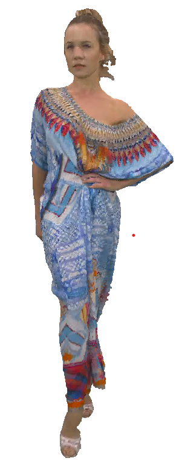

<div align="center">
    <h1>
        <strong>Composing Error Concealment Pipelines for Dynamic 3D Point Cloud Streaming</strong>
    </h1>
</div>

<div align="center">
    <a href="https://github.com/Huang-I-Chun">I-Chun Huang</a><sup>1</sup>,
    <a href="https://yuang-ian.github.io">Yuang Shi</a><sup>2</sup>,
    <a href="https://syjintw.github.io/">Yuan-Chun Sun</a><sup>1</sup>,
    <a href="https://www.comp.nus.edu.sg/~ooiwt/">Wei Tsang Ooi</a><sup>2</sup>,
    <a href="https://people.cs.nycu.edu.tw/~chuang/">Chun-Ying Huang</a><sup>3</sup>,
    <a href="https://nmsl.cs.nthu.edu.tw/cheng-hsin-hsu/">Cheng-Hsin Hsu</a><sup>1</sup>,
    <p>
        <sup>1</sup>National Tsing Hua University,
        <sup>2</sup>National University of Singapore,
        <sup>3</sup>National Yang Ming Chiao Tung University
    </p>
</div>


<div align="center">
    <a href="http://arxiv.org/abs/2408.14823" target='_blank'>
        
    </a>
    <a href="https://hits.seeyoufarm.com"></a>
</div> <br> <br>

# About


This repository contains the official implementation of the paper "Composing Error Concealment Pipelines for Dynamic 3D Point Cloud Streaming". 

This work proposes the very first error concealment pipeline framework, which comprises five stages: pre-processing, matching, motion estimation, prediction, and post-processing. The framework is designed to be flexible and extensible, allowing users to customize the pipeline in different usage scenarios.


## Implementation

### Requirements

Testing Environment Version:
- Ubuntu 20.04
- [Cmake](https://cmake.org/install/)=3.23.2
- [Point Cloud Library (PCL)](https://pointclouds.org/downloads/)=1.10.0

Example install command:
```bach
sudo apt update
sudo apt install cmake g++ make
sudo apt install libpcl-dev
```

### Build

Compile executable file `Pipeline` under a new folder `build`
```bach
git clone git@github.com:AIINS-NTHU/PCEC.git
cd PCEC
mkdir build
cd build
cmake ..
make
```

### Usage
Go back to folder `PCEC`
```bash
cd ..
```

Run following command:
```bash
python client.py -prev PREVIOUS_FRAME_PATH -next NEXT_FRAME_PATH -out OUTPUT_PATH -pos RELATIVE_POSITION
``` 

Example command:
```bash
python client.py -prev files/longdress_1051.ply -next files/longdress_1055.ply -out output.ply -pos 0.5
```
`-prev files/longdress_1051.ply` previous point cloud file we provide

`-next files/longdress_1055.ply` next point cloud file we provide

`-out files/output.ply` output point cloud file path

`-pos 0.5` means the output file is right at the middle of previous and next frames

The output.ply will look like:


### Different pipeline sample
In `config.hpp`, we've provided P, B, Q pipeline combinations for your convenience. The current pipeline in use is labeled as "Q." To switch to a different pipeline combination, simply comment or uncomment the relevant lines based on your requirements. Remember that every time you make changes to either the .hpp or .cpp files, you'll need to rebuild the project.

### Create your own Pipeline

To create custom methods, please consult the `base.hpp` file. Within `base.hpp`, we've established a virtual class called Stage, which all methods must inherit from. Additionally, in the `Pipeline_Object` definition, we've clearly specified the output variables for each stage. It's essential to ensure that any custom stage methods you create align with the input and output requirements of each respective stage. After implement your own stage method, modify the pipeline reference in `config.hpp`, and rebuild the project.


### Other tips

Given that various point cloud datasets may employ different coordinate systems and units of measurement, we recommend scaling your dataset to align with the [8iVFB dataset]((http://plenodb.jpeg.org/pc/8ilabs/)) for consistency.


# License

Distributed under the MIT License. See `LICENSE` for more information.


# Citation

If you find our work useful in your research, please consider citing the following papers:

```
@article{huang2024composing,
  title={Composing Error Concealment Pipelines for Dynamic 3D Point Cloud Streaming},
  author={Huang, I-Chun and Shi, Yuang and Sun, Yuan-Chun and Ooi, Wei Tsang and Huang, Chun-Ying and Hsu, Cheng-Hsin},
  year={2024}
}

@inproceedings{hung2022error,
  title={Error concealment of dynamic 3d point cloud streaming},
  author={Hung, Tzu-Kuan and Huang, I-Chun and Cox, Samuel Rhys and Ooi, Wei Tsang and Hsu, Cheng-Hsin},
  booktitle={Proceedings of the 30th ACM International Conference on Multimedia},
  pages={3134--3142},
  year={2022}
}

@inproceedings{wu2021dynamic,
  title={Dynamic 3D point cloud streaming: Distortion and concealment},
  author={Wu, Cheng-Hao and Li, Xiner and Rajesh, Rahul and Ooi, Wei Tsang and Hsu, Cheng-Hsin},
  booktitle={Proceedings of the 31st ACM Workshop on Network and Operating Systems Support for Digital Audio and Video},
  pages={98--105},
  year={2021}
}
```